```mermaid
flowchart TD
    A([🌐 User / Browser\nTypes https://example.com]) -->|DNS query - domain name| B

    B(["🔄 Amazon Route 53\n📍 DNS Resolution\nRouting: latency · geo · weighted · failover"])
    B -->|Returns IP address / CNAME| C

    C(["⚡ Amazon CloudFront\n🌍 CDN — Global Edge Network\nCaches static assets · TLS via ACM"])
    C -->|Cache HIT → serves instantly| A
    C -->|Cache MISS → forwards request| D

    D(["🛡️ AWS WAF + Shield\n🔒 Web Application Firewall\nBlocks: SQLi · XSS · DDoS attacks"])
    D -->|Clean request forwarded| E

    E(["⚖️ Elastic Load Balancer ALB\n🔀 Application Load Balancer\nPath / host-based routing · health checks"])

    E -->|Server-side traffic| F
    E -->|Serverless events| G

    subgraph COMPUTE ["⚙️  Compute Layer"]
        direction TB

        subgraph TRADITIONAL ["🖥️  Traditional / Containers"]
            F(["💻 Amazon EC2\nVirtual Servers\nNode · Python · Java · Ruby"])
            F --> F1(["↕️ Auto Scaling Group\nScale in/out on CPU · traffic metrics"])
            F1 --> F2(["🐳 ECS / Fargate\nManaged containers\nNo server management"])
        end

        subgraph SERVERLESS ["λ  Serverless"]
            G(["λ AWS Lambda\nEvent-driven functions\nPay per invocation · no servers"])
            G --> G1(["🌐 API Gateway\nHTTP · REST · WebSocket\nFront-door for Lambda"])
            G1 --> G2(["💡 Step Functions\nOrchestrate multi-Lambda\nworkflows · retries · branches"])
        end
    end

    F2 -->|reads / writes| H
    G2 -->|reads / writes| H
    F -->|reads / writes| H
    G -->|reads / writes| H

    subgraph DATA ["🗄️  Data Layer"]
        direction LR
        H1(["📀 Amazon RDS\nRelational DB\nMySQL · Postgres · Aurora\nMulti-AZ HA"])
        H2(["⚡ DynamoDB\nServerless NoSQL\nKey-value · Document\nSingle-digit ms latency"])
        H3(["📦 Amazon S3\nObject Storage\nStatic files · Images\nBackups · Static websites"])
        H4(["🚀 ElastiCache\nRedis / Memcached\nIn-memory cache\nSessions · hot data"])
    end

    H --> H1
    H --> H2
    H --> H3
    H1 <-->|cache layer| H4
    H2 <-->|cache layer| H4

    subgraph OBS ["📊  Observability & Security"]
        direction LR
        I1(["📈 CloudWatch\nMetrics · Logs · Alarms\nDashboards · Auto-scaling triggers"])
        I2(["🔍 X-Ray / CloudTrail\nDistributed tracing\nAudit log of all API calls"])
        I3(["🔐 IAM + Secrets Manager\nIdentity & access control\nDB credentials · API keys"])
    end

    COMPUTE -->|logs & metrics| I1
    COMPUTE -->|traces & audit| I2
    DATA -->|logs & metrics| I1
    I3 -.->|governs all service calls| COMPUTE
    I3 -.->|governs all service calls| DATA

    I1 -->|alarm triggers| E
    I1 -->|alarm triggers| F1

    style A fill:#1a3a6a,stroke:#64b5f6,color:#e8eaf6
    style B fill:#2a0a3e,stroke:#ba68c8,color:#e8eaf6
    style C fill:#0a2e28,stroke:#4db6ac,color:#e8eaf6
    style D fill:#3e0a0a,stroke:#ef5350,color:#e8eaf6
    style E fill:#2e1e00,stroke:#ff9900,color:#e8eaf6

    style F fill:#0a2e10,stroke:#66bb6a,color:#e8eaf6
    style F1 fill:#0a2e10,stroke:#81c784,color:#e8eaf6
    style F2 fill:#0a2e10,stroke:#81c784,color:#e8eaf6
    style G fill:#1a2e0a,stroke:#aed581,color:#e8eaf6
    style G1 fill:#1a2e0a,stroke:#aed581,color:#e8eaf6
    style G2 fill:#1a2e0a,stroke:#aed581,color:#e8eaf6

    style H1 fill:#0a1a3e,stroke:#42a5f5,color:#e8eaf6
    style H2 fill:#0a1a3e,stroke:#64b5f6,color:#e8eaf6
    style H3 fill:#3e2a00,stroke:#ffa726,color:#e8eaf6
    style H4 fill:#2e0a1a,stroke:#f06292,color:#e8eaf6

    style I1 fill:#1a0a2e,stroke:#ab47bc,color:#e8eaf6
    style I2 fill:#1a0a2e,stroke:#ce93d8,color:#e8eaf6
    style I3 fill:#2e0a1a,stroke:#ec407a,color:#e8eaf6

    style TRADITIONAL fill:#0d1f0d,stroke:#66bb6a
    style SERVERLESS fill:#151f0d,stroke:#aed581
    style COMPUTE fill:#0a1a0a,stroke:#4caf50
    style DATA fill:#0a0a1a,stroke:#42a5f5
    style OBS fill:#1a0a2a,stroke:#ab47bc
```

# AWS Website Hosting — Architecture Flowchart

> **How it works:** User types a URL → DNS lookup → CDN edge → security layer → load balancer → compute (EC2 or Lambda) → data stores → observability.

---



---

## Request Journey — Step by Step

| # | Service | Role | Key Feature |
|---|---------|------|-------------|
| 1 | **User / Browser** | Initiates request | Types `https://example.com` |
| 2 | **Route 53** | DNS resolution | Returns IP · supports geo/latency routing |
| 3 | **CloudFront** | CDN edge cache | Serves cached assets globally · TLS via ACM |
| 4 | **WAF + Shield** | Security filter | Blocks SQLi, XSS, DDoS before hitting servers |
| 5 | **ALB** | Load balancing | Routes HTTP/S traffic to healthy targets |
| 6a | **EC2 / ECS / Fargate** | Server compute | Traditional apps and containers |
| 6b | **Lambda + API Gateway** | Serverless compute | Event-driven, pay-per-use functions |
| 7a | **RDS** | Relational DB | MySQL / Postgres / Aurora with Multi-AZ |
| 7b | **DynamoDB** | NoSQL DB | Serverless, single-digit ms at any scale |
| 7c | **S3** | Object storage | Static files, images, backups, static sites |
| 8 | **ElastiCache** | In-memory cache | Redis/Memcached — reduce DB load |
| 9a | **CloudWatch** | Metrics & alarms | Logs, dashboards, auto-scaling triggers |
| 9b | **X-Ray / CloudTrail** | Tracing & audit | Distributed traces + every API call logged |
| 9c | **IAM + Secrets Manager** | Identity & secrets | Governs all service-to-service permissions |

---

## Architecture Patterns

```
Static Website:
  Route 53 → CloudFront → S3 (no EC2/Lambda needed)

API Backend:
  Route 53 → CloudFront → WAF → API Gateway → Lambda → DynamoDB

Full-stack App:
  Route 53 → CloudFront → WAF → ALB → EC2/ECS → RDS + ElastiCache

Hybrid:
  Route 53 → CloudFront → WAF → ALB
    ├── /api/*  → Lambda (serverless)
    └── /app/*  → EC2 (traditional)
```

---

> **Tip:** Open this file in VS Code with the [Markdown Preview Mermaid Support](https://marketplace.visualstudio.com/items?itemName=bierner.markdown-mermaid) extension, or view on GitHub — the diagram renders automatically.
