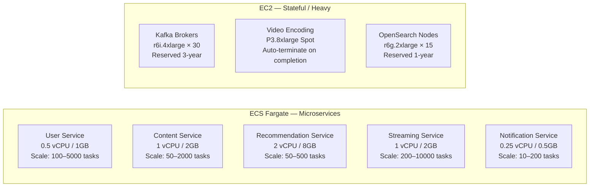
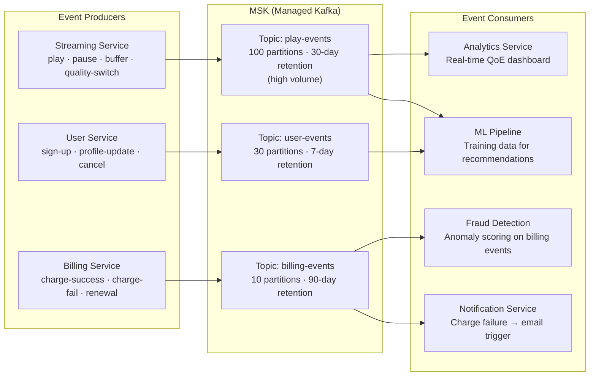
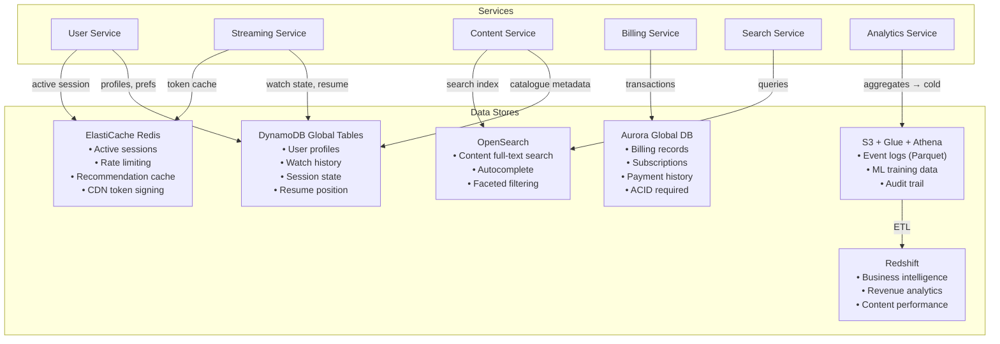
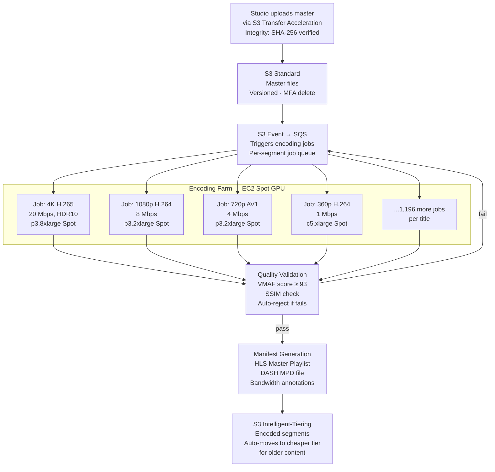
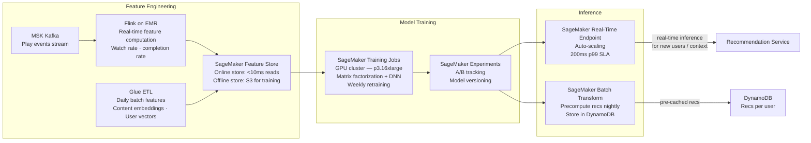
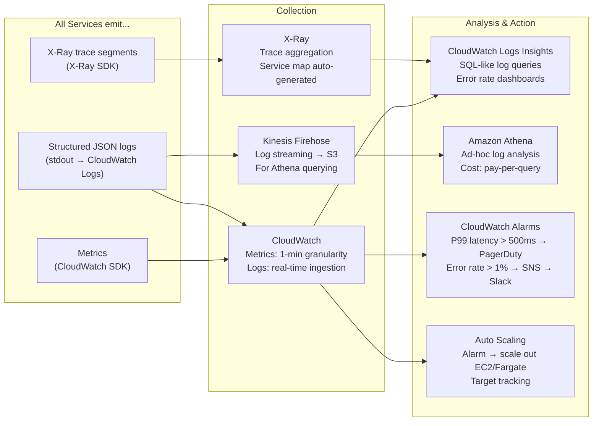
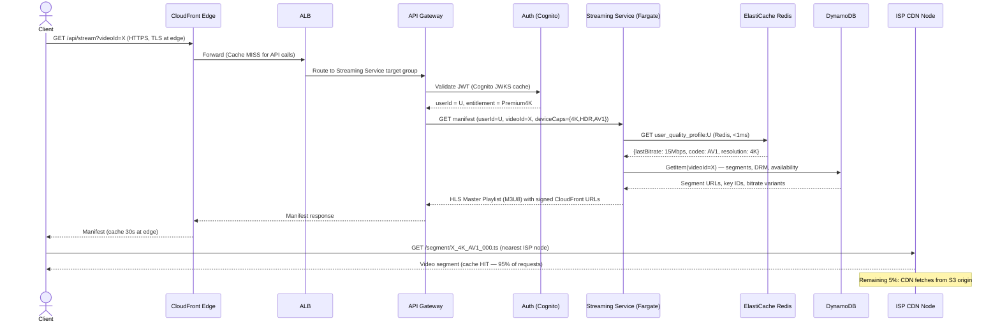
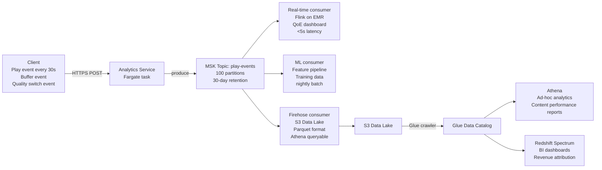
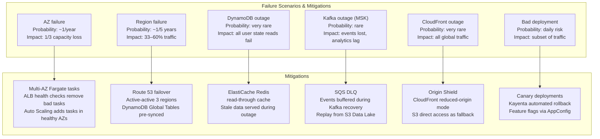

# Large-Scale Application Hosting on AWS — System Design Reference

> This document covers how to architect a large-scale, globally distributed application on AWS — a video streaming platform serving **250M+ users**, handling **millions of concurrent streams**, and deploying **1,000+ microservices**. Every service choice is justified with trade-off analysis.

---

## Table of Contents

1. [Requirements & Scale Targets](#1-requirements--scale-targets)
2. [Full Architecture Diagram](#2-full-architecture-diagram)
3. [Layer-by-Layer Design](#3-layer-by-layer-design)
   - [Edge & DNS Layer](#31-edge--dns-layer)
   - [Security Layer](#32-security-layer)
   - [API Gateway Layer](#33-api-gateway-layer)
   - [Microservices Compute Layer](#34-microservices-compute-layer)
   - [Async Messaging Layer](#35-async-messaging-layer)
   - [Data Layer](#36-data-layer)
   - [Content Delivery & Video Processing](#37-content-delivery--video-processing)
   - [Machine Learning Layer](#38-machine-learning-layer)
   - [Observability Layer](#39-observability-layer)
4. [Data Flow Diagrams](#4-data-flow-diagrams)
5. [Capacity Estimation](#5-capacity-estimation)
6. [Service Trade-off Decisions](#6-service-trade-off-decisions)
7. [Resilience & Disaster Recovery](#7-resilience--disaster-recovery)
8. [Cost Architecture](#8-cost-architecture)
9. [Scaling Playbook](#9-scaling-playbook)

---

## 1. Requirements & Scale Targets

### Functional Requirements
- Users can **browse, search, and stream video content**
- Personalized **recommendations** per user
- **Multi-device** support (web, iOS, Android, Smart TV, Chromecast)
- **Multi-region** streaming with low latency globally
- **Adaptive bitrate** streaming (quality adjusts to network conditions)
- User **authentication, profiles, watch history**
- Real-time **analytics** on playback quality

### Non-Functional Requirements

| Metric | Target |
|--------|--------|
| Availability | 99.99% (< 52 min downtime/year) |
| Global latency (TTFB for API) | < 100ms |
| Video start time | < 2 seconds |
| Concurrent streams | 20M+ |
| Peak API throughput | 5M requests/second |
| Data durability (video masters) | 99.999999999% (11 nines) |
| RTO (Recovery Time Objective) | < 60 seconds |
| RPO (Recovery Point Objective) | < 5 seconds |

### Scale Numbers

```
Users:              250M registered, 100M daily active
Content library:    50,000+ titles
Encoded versions:   1,200+ per title (codec × resolution × bitrate)
Video storage:      Exabytes of encoded content
Events per day:     500B+ (play, pause, seek, quality switch)
Deployments/day:    500+ (microservices CI/CD)
AWS accounts:       100+ (one per team for blast radius isolation)
```

---

## 2. Full Architecture Diagram

```mermaid
flowchart TD
    subgraph CLIENTS ["📱 Client Devices"]
        TV["🖥️ Smart TV / Streaming Stick"]
        MOB["📱 Mobile — iOS / Android"]
        WEB["💻 Web Browser"]
        CONSOLE["🎮 Game Console / Set-top Box"]
    end

    subgraph EDGE ["🌍 Edge Layer"]
        R53["🔄 Route 53\nLatency-based routing\nHealth-check failover\nWeighted for canary"]
        CF["⚡ CloudFront\n450+ PoPs globally\nSSL termination\nShield Advanced"]
        CDN_CUSTOM["📡 Custom ISP CDN Nodes\nEmbedded in ISP networks\nVideo-only traffic\n95%+ cache hit rate"]
    end

    subgraph SEC ["🛡️ Security Layer"]
        WAF["AWS WAF\nOWASP top 10 rules\nRate limiting per IP\nBot mitigation"]
        SHIELD["AWS Shield Advanced\n$3,000/month\nSLA-backed DDoS mitigation\n24/7 DRT team access"]
        GUARD["Amazon GuardDuty\nThreat intelligence\nAnomaly detection\nAuto-remediation via Lambda"]
    end

    subgraph GW ["🚪 API Gateway Layer"]
        ALB["Application Load Balancer\nPath-based routing\nHealth checks\nSticky sessions off"]
        APIGW["API Gateway (HTTP)\nThrottling per route\nJWT auth via Cognito\nUsage plans per tier"]
        GQL["AWS AppSync (GraphQL)\nMobile / TV clients\nReal-time subscriptions\nOffline sync"]
    end

    subgraph COMPUTE ["⚙️ Microservices — ECS Fargate + EC2"]
        US["👤 User Service\nProfiles · Auth\nPreferences"]
        CS["🎬 Content Service\nCatalogue metadata\nAvailability regions"]
        RS["🤖 Recommendation Service\nPersonalized rows\nML model inference"]
        SS["▶️ Streaming Service\nManifest generation\nBitrate ladder\nDRM key delivery"]
        NS["🔔 Notification Service\nPush · Email · SMS"]
        AS["📊 Analytics Service\nQoE metrics\nPlayback events"]
        SRCH["🔍 Search Service\nFull-text search\nAutocomplete"]
        PAY["💳 Billing Service\nSubscription mgmt\nPayment gateway"]
    end

    subgraph MSG ["📨 Async Messaging"]
        KAFKA["Apache Kafka (MSK)\nEvent backbone\n500B events/day\nCompacted topics"]
        SQS2["Amazon SQS FIFO\nTask queues\nDead-letter queues\nExactly-once delivery"]
        EVB["Amazon EventBridge\nService events\nScheduled triggers\nSaaS integrations"]
        SNS2["Amazon SNS\nFan-out broadcasts\nMobile push\nEmail notifications"]
    end

    subgraph DATA ["🗄️ Data Layer"]
        DDB["Amazon DynamoDB\nGlobal Tables\nUser state · Sessions\nViewing history"]
        AURORA["Amazon Aurora Global\nBilling · Accounts\nACID transactions\nMulti-region read"]
        REDIS["ElastiCache Redis\nSession cache\nRate limiting\nLeaderboards"]
        OS["Amazon OpenSearch\nContent search index\nLog analytics\nKibana dashboards"]
        S3DATA["S3 Data Lake\nRaw events (Parquet)\nML training data\nAudit logs"]
        RS2["Amazon Redshift\nBI analytics\nRevenue reporting\nContent performance"]
    end

    subgraph VIDEO ["🎞️ Video Processing"]
        S3RAW["S3\nRaw master files\n100GB–2TB per title"]
        TRANSCODE["EC2 Spot GPU Fleet\nP3 / P4 instances\n1,200+ encode jobs/title"]
        MEDIACONV["AWS Elemental MediaConvert\nManaged encoding\nHLS · DASH · CMAF"]
        S3ENC["S3\nEncoded segments\nHLS chunks\nDASH fragments"]
    end

    subgraph ML ["🤖 ML Platform"]
        SAGE["Amazon SageMaker\nModel training (GPU)\nOnline inference\nA/B experiment tracking"]
        FEATURESTORE["SageMaker Feature Store\nReal-time features\nBatch features\nUser + content vectors"]
    end

    subgraph OBS ["📊 Observability"]
        CW["CloudWatch\nMetrics · Alarms\nLogs · Dashboards\nAuto Scaling triggers"]
        XRAY["AWS X-Ray\nDistributed traces\nService map\nLatency p99 per route"]
        FIREHOSE["Kinesis Firehose\nLogs → S3 → Athena\nReal-time log delivery"]
    end

    subgraph HA ["🔁 High Availability"]
        ASG2["Auto Scaling Groups\nTarget tracking\nScheduled scaling\nWarm pools"]
        MRAZ["Multi-AZ Active\nus-east-1a/b/c\nAll services 3-AZ"]
        MREG["Multi-Region Active\nus-east-1 primary\neu-west-1 active\nap-northeast-1 active"]
    end

    CLIENTS -->|"DNS lookup"| R53
    R53 -->|"CloudFront IP (nearest PoP)"| CF
    CF --> WAF --> SHIELD
    SHIELD -->|"API calls"| ALB
    SHIELD -->|"GraphQL"| GQL
    ALB --> APIGW
    APIGW --> US & CS & RS & SS & NS & AS & SRCH & PAY
    GQL --> RS & CS & SS

    SS -->|"manifest URL"| CF
    CF -->|"video bytes"| CDN_CUSTOM
    CDN_CUSTOM -->|"cache miss"| S3ENC

    US --> DDB & REDIS
    CS --> DDB & OS
    RS --> FEATURESTORE & REDIS
    SS --> DDB & REDIS
    PAY --> AURORA
    SRCH --> OS

    KAFKA --> AS & RS & SAGE
    US & SS & AS --> KAFKA
    NS --> SNS2 & SQS2
    EVB --> NS & PAY

    S3RAW --> TRANSCODE & MEDIACONV
    TRANSCODE --> S3ENC
    MEDIACONV --> S3ENC

    SAGE --> RS
    FEATURESTORE --> SAGE

    KAFKA --> FIREHOSE --> S3DATA --> RS2
    COMPUTE --> CW & XRAY
    DATA --> CW
    CW --> ASG2

    GUARD --> COMPUTE
    MRAZ --> COMPUTE & DATA
    MREG --> R53

    style CLIENTS fill:#0d1628,stroke:#64b5f6
    style EDGE fill:#0d2010,stroke:#4db6ac
    style SEC fill:#2e0d0d,stroke:#ef5350
    style GW fill:#2e1e00,stroke:#ff9900
    style COMPUTE fill:#0a2e10,stroke:#66bb6a
    style MSG fill:#1a0a2e,stroke:#ba68c8
    style DATA fill:#0a1a3e,stroke:#42a5f5
    style VIDEO fill:#2e1a00,stroke:#ffa726
    style ML fill:#1a0a1a,stroke:#ce93d8
    style OBS fill:#1a0a2e,stroke:#ab47bc
    style HA fill:#0a2e28,stroke:#4db6ac
```



---

## 3. Layer-by-Layer Design

### 3.1 Edge & DNS Layer

#### Amazon Route 53

**Configuration:**
- **Latency-based routing** — users routed to the AWS region with the lowest network latency, measured continuously from 50+ AWS edge nodes
- **Health checks** on ALB endpoints in all 3 active regions — automatic DNS failover in 60–120 seconds
- **Weighted routing** (0–100%) for canary region rollouts — shift 5% of traffic to a new region stack before full cutover
- TTL set to **30 seconds** — fast failover but ~30 second propagation lag

**Why Route 53 over self-managed DNS:**
- 100% availability SLA (Route 53 is backed by Anycast across 100+ locations)
- Built-in health check + failover in one service
- No DNS infrastructure to operate

**Trade-off:** 30-second TTL means some users get stale DNS during failover. Longer TTL = cheaper / faster DNS, shorter TTL = more Route 53 queries. 30s is the balance point for this SLA target.

---

#### Amazon CloudFront

**What it handles:**
- TLS termination at the edge — no TLS handshake over the transatlantic backbone for US/EU users
- Caching JS bundles, images, HTML shells — 90%+ cache hit rate for static assets
- Serving video manifests (M3U8 / MPD files) cached at the edge
- WAF and Shield Advanced integration

**Cache-Control strategy:**

```
Static assets (JS/CSS):    Cache-Control: max-age=31536000, immutable (hash in filename)
HTML shell:                Cache-Control: no-cache (always fresh, small)
Video manifests:           Cache-Control: max-age=30 (updated when new segment available)
API responses:             Cache-Control: no-store (never cached at edge)
```

**Trade-off — CloudFront for video:**
- At 250M subscribers, delivering video through CloudFront would cost ~$0.0085/GB in egress
- A single HD stream = ~2.5 GB/hour; 20M concurrent streams = 50 TB/hour = $425/hour just in egress
- **Decision: custom ISP-embedded CDN for video, CloudFront for API/web assets only**

---

### 3.2 Security Layer

#### AWS WAF Rules Applied

```yaml
Rules:
  - AWSManagedRulesCommonRuleSet      # OWASP Top 10
  - AWSManagedRulesKnownBadInputs     # Log4Shell, Spring4Shell
  - AWSManagedRulesBotControlRuleSet  # Bot mitigation
  - Custom RateBasedRule:
      limit: 2000 requests / 5 minutes / IP
      action: BLOCK
  - Custom GeoRestriction:
      block: regions where content rights not licensed
```

#### AWS Shield Advanced

**Cost:** $3,000/month flat fee + data transfer charges

**What you get over Shield Standard:**
- SLA-backed DDoS mitigation (not just best-effort)
- Access to AWS DDoS Response Team (DRT) 24/7
- Cost protection — AWS reimburses scaling costs caused by DDoS attacks
- Advanced attack visibility in CloudWatch

**Trade-off:** $36,000/year. Worth it for a consumer streaming service that is an attractive DDoS target. A 1-hour outage costs far more in subscriber churn.

---

#### Amazon GuardDuty

- Continuously analyzes CloudTrail, VPC Flow Logs, DNS query logs
- ML-based anomaly detection: unusual API call patterns, credential compromise signals
- Auto-remediation: GuardDuty finding → EventBridge → Lambda → rotate IAM credentials / quarantine EC2

---

### 3.3 API Gateway Layer

#### Two-gateway strategy

```
Mobile / TV clients  →  AppSync (GraphQL)
   Reason: typed schema, subscriptions for live updates,
           automatic offline sync for mobile, batched queries reduce round trips

Web / Server-to-server  →  ALB → API Gateway (HTTP API)
   Reason: simpler REST semantics, cheaper than REST API Gateway,
           path-based routing to ECS services behind ALB
```

**API Gateway (HTTP API) vs REST API:**

| Factor | HTTP API | REST API |
|--------|----------|---------|
| Price | $1.00/million | $3.50/million |
| Latency | ~6ms overhead | ~30ms overhead |
| Features | JWT auth, CORS, OIDC | Full: caching, request transformation, usage plans |
| Use here | Standard microservice routing | Only for public API with usage plans per partner |

**Decision:** HTTP API for internal/app traffic (10x cheaper, 5x faster), REST API only for partner API with metered usage plans.

---

### 3.4 Microservices Compute Layer

#### Container strategy: ECS Fargate for most, EC2 for heavy workloads



**Why ECS Fargate over EC2 for microservices:**
- No EC2 fleet to patch, right-size, or replace
- **Per-task billing** — idle tasks (overnight, low-traffic) cost nothing vs. idle EC2
- Fargate scales to 10,000 tasks in ~2 minutes — sufficient for traffic spikes
- Integrated with CloudWatch, X-Ray, ALB target groups — no extra config

**Why EC2 for Kafka / Encoding / OpenSearch:**
- **Kafka**: needs persistent EBS volumes for log retention, specific instance types for throughput. Fargate's ephemeral storage is insufficient.
- **Video encoding**: GPU instances (P3/P4) not available on Fargate. Spot EC2 gives 70% cost savings for interruptible jobs.
- **OpenSearch**: memory-intensive, benefits from reserved instance discounts and specific CPU/memory ratios.

**Auto-scaling configuration:**

```yaml
Streaming Service:
  metric: ALB RequestCountPerTarget
  target: 100 requests/target/minute
  scale-out: +20% capacity when above threshold for 60s
  scale-in: -10% capacity when below threshold for 300s  # conservative scale-in
  min: 200 tasks   # always-on capacity for instant traffic absorption
  max: 10000 tasks

Recommendation Service:
  metric: SQS QueueDepth (inference requests)
  target: < 50 messages in queue
  min: 50 tasks
  max: 500 tasks
```

---

### 3.5 Async Messaging Layer

#### Event Architecture



**Why MSK (Managed Kafka) over Kinesis:**

| Factor | MSK | Kinesis |
|--------|-----|---------|
| Ecosystem | Kafka Streams, Flink, ksqlDB, connectors | AWS-native only |
| Partition model | Unlimited partitions, free | $0.015/shard-hour |
| Retention | Configurable / unlimited (tiered) | 7 days max (standard) |
| Consumer groups | Unlimited | One application per shard |
| Ops overhead | Broker management (automated by MSK) | Zero |
| Cost at 500B events/day | Lower | Higher (shard costs add up) |

**Why SQS FIFO for task queues (not Kafka):**
- Notification sends, email jobs, async tasks that need **exactly-once** delivery
- SQS FIFO guarantees no duplicate sends (critical for billing emails)
- Kafka at-least-once delivery → duplicates possible → idempotency required everywhere

**Why EventBridge for scheduled triggers:**
- Subscription renewal reminders (daily batch → EventBridge Scheduler → Lambda)
- Content availability windows (when a licence starts/expires)
- No cron infrastructure to manage

---

### 3.6 Data Layer

#### Database selection per service



**DynamoDB design for 250M users:**

```
Table: user_state
  PK: user_id
  SK: content_id
  Attributes: position_seconds, completed, quality_history, last_updated

Access pattern: GetItem by (user_id, content_id) — always known
Write: UpdateItem on every play event (debounced 30s)
GSI: by last_updated for "continue watching" row (scan avoided by GSI)

Global Tables: us-east-1, eu-west-1, ap-northeast-1
Read consistency: Eventual (acceptable — resume position accuracy vs. cost)
Write capacity: On-demand (absorbs bursty new episode releases)
```

**Why Aurora over RDS for billing:**
- Aurora fails over in **<30 seconds** (RDS = 60–120s) — billing downtime is unacceptable
- Aurora Global Database replicates to read replica in eu-west-1 — GDPR queries from EU region hit EU
- Aurora Serverless v2 not used here — billing load is predictable, provisioned is cheaper

---

### 3.7 Content Delivery & Video Processing

#### Video encoding pipeline



**Why Spot instances for encoding:**
- Encoding jobs are **checkpoint-able** — if a Spot instance is reclaimed, the job resumes from the last saved segment
- **70% cost reduction** vs On-Demand for P3 GPU instances
- Spot interruption rate for GPU instances is low (~5% per month) — acceptable for background workload

**Storage class strategy for encoded content:**

```
New releases (< 30 days):    S3 Standard        — high retrieval rate, pay for instant access
Catalogue (30d–1yr):         S3 Intelligent-Tiering — auto-moves to Infrequent Access
Long-tail (> 1yr):           S3 Glacier Instant Retrieval — rare access, 68% cost savings vs Standard
Master files (all):          S3 Standard + Object Lock (WORM) — cannot be deleted
```

---

### 3.8 Machine Learning Layer

#### Recommendation system architecture



**Why pre-computed + real-time hybrid:**
- **Pre-computed** (nightly batch → DynamoDB): 95% of requests — fast, cheap, cache-friendly
- **Real-time** (SageMaker endpoint): new users, context changes (time of day, device switch), after watch events
- Pure real-time inference: too expensive at 250M users × request rate
- Pure batch: stale, misses "just watched X, now recommend Y"

---

### 3.9 Observability Layer

#### Three pillars: Metrics, Logs, Traces



**Key metrics to alarm on:**

```yaml
Critical (page on-call immediately):
  - StreamingService.ManifestLatency p99 > 500ms
  - ALB.5XX rate > 0.1%
  - DynamoDB.SystemErrors > 0
  - Route53.HealthCheckStatus = UNHEALTHY for any region

Warning (Slack notification, no page):
  - StreamingService.ManifestLatency p95 > 200ms
  - ECS.CPUUtilization > 80% for > 5 minutes
  - ElastiCache.CacheHits < 90%

Informational (dashboard only):
  - ConcurrentStreams (watch for spikes)
  - NewEpisodeEncodingQueue depth
```

---

## 4. Data Flow Diagrams

### Play Request Flow (Critical Path)



### Event Processing Flow (Async Path)



---

## 5. Capacity Estimation

### Storage

```
Video content (encoded):
  50,000 titles × 1,200 versions × avg 10 GB/version
  = 50,000 × 1,200 × 10 = 600,000,000 GB = 600 PB

Video masters (raw):
  50,000 titles × avg 500 GB = 25,000,000 GB = 25 PB

Event data (Kafka + S3):
  500B events/day × 1 KB/event = 500 TB/day raw
  Parquet compression (~10x): 50 TB/day in S3
  1 year retention: 50 TB × 365 = 18.25 PB

DynamoDB:
  250M users × 10 KB user record = 2.5 TB
  250M users × avg 200 watch history entries × 100B = 5 TB
  Total: ~10 TB (small relative to video storage)
```

### Compute (peak load)

```
Concurrent streams (peak):          20M
Streaming Service requests/stream:  1 manifest + 1 segment/~10s = 3 req/min/stream
Total Streaming Service RPS:        20M × 3/60 = 1M RPS
Fargate tasks needed:               1M RPS / 500 RPS per task = 2,000 tasks
Fargate vCPU:                       2,000 × 1 vCPU = 2,000 vCPU
Fargate cost at peak:               2,000 × $0.04048/vCPU-hr = $81/hour

Auth validations:                   Same as API calls = 5M RPS at full load
Cognito JWKS cached in-process:     Avoids per-request Cognito call → free
```

### Network egress

```
Video delivery (ISP CDN — not AWS egress):    excluded — own CDN
API responses:                                avg 5 KB × 5M RPS = 25 GB/s
CloudFront to origin (cache misses ~10%):     25 GB/s × 10% × AWS pricing
S3 to CloudFront (first mile):                free (S3 → CloudFront egress is free)
Cross-region DynamoDB replication:            DynamoDB Global Tables charges replicated WCUs
```

---

## 6. Service Trade-off Decisions

### Decision Matrix

| Decision | Option A | Option B | Winner | Reason |
|----------|----------|----------|--------|--------|
| Microservice compute | ECS Fargate | EKS (Kubernetes) | **Fargate** | No K8s expertise needed; 80% lower ops overhead; EKS $73/mo control plane per cluster |
| Primary user DB | DynamoDB | Aurora | **DynamoDB** | Access always by user ID (no JOINs); Global Tables for multi-region; scales to 250M users |
| Billing DB | DynamoDB | Aurora | **Aurora** | Billing requires full ACID; JOINs needed for invoice queries; failover < 30s |
| Event streaming | MSK (Kafka) | Kinesis | **MSK** | Kafka ecosystem (Flink, connectors); unlimited retention; cost at 500B events/day |
| ML inference | SageMaker endpoint | EC2 self-managed | **SageMaker** | Auto-scaling endpoints; no GPU fleet to manage; A/B testing built-in |
| API auth | Cognito | Custom JWT service | **Cognito** | JWKS caching in API Gateway; social login built-in; no auth code to maintain |
| Notification fan-out | SNS | SQS | **SNS → SQS** | SNS fans out to email/push/SMS; SQS buffers for retry per channel |
| Search | OpenSearch | DynamoDB + filter | **OpenSearch** | Full-text + facets + autocomplete; DynamoDB filter scans are too slow at 50K titles |
| Caching | ElastiCache Redis | In-memory (Fargate) | **Redis** | Shared across all tasks; survives task replacement; TTL + eviction built-in |
| Encoding | EC2 Spot | AWS MediaConvert | **EC2 Spot** | Custom codecs (AV1), custom VMAF QC pipeline, 40% cheaper at scale |

---

## 7. Resilience & Disaster Recovery

### Failure mode analysis



### Circuit Breaker Pattern (all inter-service calls)

```
Service A calls Service B:
  Normal: Request → Response in <200ms
  Slow:   Request → Timeout after 200ms → retry × 2 → log warning
  Open:   >50% failures in 10s window → Circuit OPEN
           Service A returns cached/default response (degraded mode)
           Circuit half-open after 30s: test one request
  Recover: Success → Circuit CLOSED → normal operation resumes

Implemented via: Resilience4j in Java services, Polly in .NET services
```

---

## 8. Cost Architecture

### Cost breakdown at scale (estimated monthly)

| Service | Usage | Estimated Cost |
|---------|-------|---------------|
| EC2 (Kafka, Encoding Spot, OpenSearch) | ~5,000 instance-hours/day | $200K–$500K |
| ECS Fargate (microservices) | 10,000 vCPU-hours/day | $120K–$200K |
| DynamoDB Global Tables | 500M RCU/WCU + 3 regions | $500K–$1M |
| ElastiCache Redis | 20 cache.r6g.4xlarge nodes | $50K |
| Aurora Global DB | 2 writer + 10 reader instances | $80K |
| MSK (Kafka) | 30 broker nodes (r6i.4xlarge) | $120K |
| S3 (video storage ~600 PB) | $0.023/GB → Lifecycle to Glacier | $2M–$5M |
| CloudFront (API/web assets) | 500 TB/month transfer | $40K |
| Route 53 | 5B DNS queries/month | $20K |
| Shield Advanced | Flat fee | $3K |
| SageMaker | Training + inference endpoints | $100K |
| CloudWatch + X-Ray | Metrics + traces | $50K |
| **Total estimated** | | **$3.5M–$7M/month** |

### Cost optimization levers

```
1. Reserved Instances (1 or 3 year):
   Kafka, OpenSearch, RDS Aurora → 40–60% savings vs On-Demand

2. Spot Instances for encoding:
   P3 GPU instances: 70% cheaper than On-Demand on Spot

3. S3 Intelligent-Tiering:
   Content > 30 days auto-tiered → 45% cheaper storage for cold catalogue

4. DynamoDB Reserved Capacity:
   Predictable base load → reserve 50% → 76% savings on reserved capacity

5. Savings Plans (Compute):
   1-year compute savings plan on Fargate → 17% savings

6. CloudFront to S3 (free egress):
   Video segments: S3 → CloudFront = $0 egress (same-region)
```

---

## 9. Scaling Playbook

### Traffic patterns and pre-scaling

```
Pattern: New season of popular show drops at 9PM PT

Pre-scale actions (automated via EventBridge Scheduler):
  T-30 min: Scale Streaming Service from 2,000 → 5,000 Fargate tasks
  T-30 min: ElastiCache Redis cluster scale out +30% nodes
  T-30 min: Pre-warm CloudFront (submit manifest URLs for caching)
  T-30 min: DynamoDB on-demand mode (already set — auto-handles spikes)
  T-30 min: Increase Kafka consumer group parallelism

During spike:
  CloudWatch Alarm (RequestCount > threshold) → Auto Scaling adds Fargate tasks
  Target Tracking: maintain 60% CPU utilization across fleet

Post-spike (4 hours later):
  Scale-in protection: wait 5 minutes before removing tasks
  Scale back to baseline over 30 minutes (not instant — trailing long-tail)
```

### Deployment pipeline (zero-downtime)

```
Code merge → CodePipeline triggers:
  1. Unit + integration tests (CodeBuild, ~5 min)
  2. Docker image build + push to ECR
  3. Deploy to staging ECS cluster
  4. Synthetic canary tests (CloudWatch Synthetics, 5 min)
  5. Canary deploy: 5% traffic to new task definition (ALB weighted target groups)
  6. Kayenta: compare error rate, p99 latency between canary and baseline (10 min)
  7. Auto-promote to 100% if metrics pass | auto-rollback if they fail
  8. Old task definition drained over 30s (ALB connection draining)

Total deploy time: ~25 minutes, zero user-visible downtime
Rollback time: ~60 seconds (flip ALB target group weight to 0%)
```

---

> **Architecture principle:** No architecture is universally correct — every decision is a trade-off between cost, complexity, operational burden, and performance. At 250M users, managed services (Fargate, DynamoDB, MSK) reduce ops overhead even at higher per-unit cost, because engineering time is more expensive than cloud bills. The right answer changes every 2–3 years as AWS services improve.
