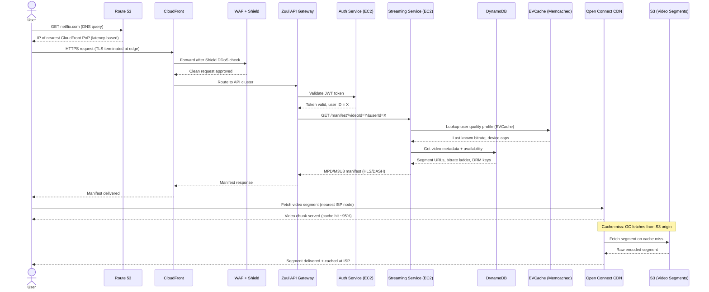
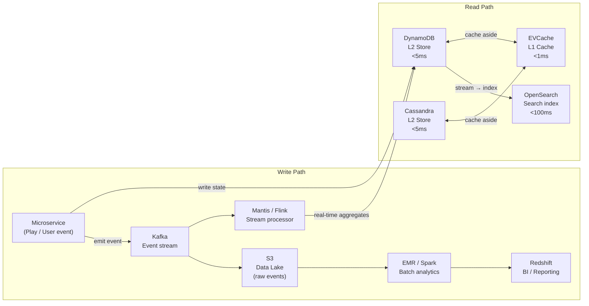
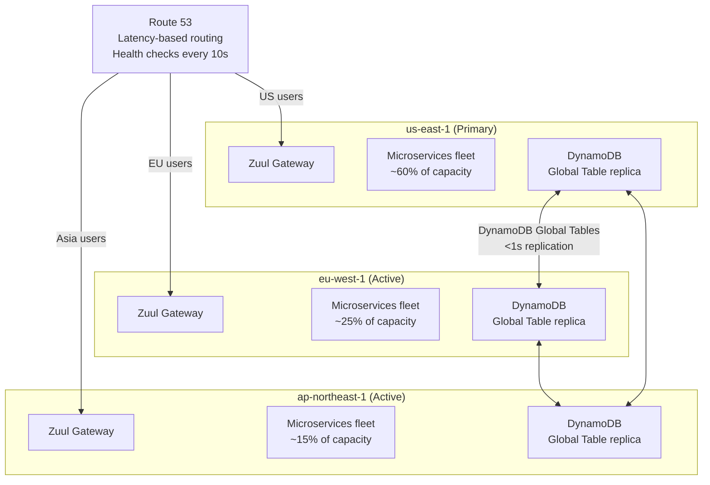
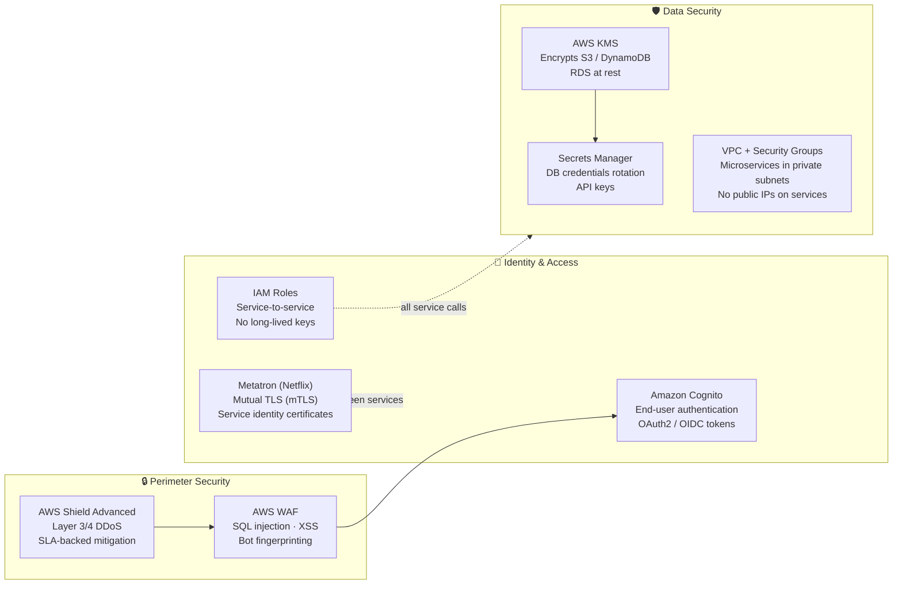

# Netflix on AWS — Real-World Architecture Deep Dive

> Netflix is one of the most documented large-scale AWS deployments in the world. They serve **250M+ subscribers**, stream **700,000+ hours of content per minute**, operate across **190+ countries**, and run almost entirely on AWS. This document breaks down their real architecture, why they chose each service, and what trade-offs they accepted.

---

## Table of Contents

1. [Scale Numbers](#1-scale-numbers)
2. [High-Level Architecture Diagram](#2-high-level-architecture-diagram)
3. [Request Flow — What Happens When You Press Play](#3-request-flow--what-happens-when-you-press-play)
4. [Service-by-Service Breakdown](#4-service-by-service-breakdown)
5. [Data Architecture](#5-data-architecture)
6. [Video Encoding Pipeline](#6-video-encoding-pipeline)
7. [Resilience Engineering](#7-resilience-engineering)
8. [Observability Stack](#8-observability-stack)
9. [Security Architecture](#9-security-architecture)
10. [Trade-offs Netflix Made](#10-trade-offs-netflix-made)
11. [Key Lessons](#11-key-lessons)

---

## 1. Scale Numbers

| Metric | Number |
|--------|--------|
| Subscribers | 250M+ |
| Content hours streamed / minute | 700,000+ |
| Peak internet traffic (% of North America downstream) | ~15% |
| AWS regions active simultaneously | 3 (us-east-1 primary + 2 more) |
| Microservices | 1,000+ |
| EC2 instances (peak) | 100,000+ |
| Videos encoded per title | 1,200+ versions (resolution × bitrate × codec) |
| CDN nodes (Open Connect) | 17,000+ servers in 6,000+ locations |
| API requests / second (peak) | Millions |

---

## 2. High-Level Architecture Diagram

```mermaid
flowchart TD
    subgraph CLIENTS ["📱 Client Devices"]
        C1["🖥️ Smart TV / FireStick"]
        C2["📱 iOS / Android"]
        C3["💻 Web Browser"]
    end

    subgraph EDGE ["🌍 Edge & DNS Layer"]
        R53["🔄 Route 53\nDNS + Health-check failover\nLatency-based routing per region"]
        CF["⚡ CloudFront\nSSL termination · DDoS\nShield Advanced"]
        OC["📡 Open Connect CDN\nNetflix proprietary CDN\n17,000+ servers in ISPs globally"]
    end

    subgraph GATEWAY ["🚪 API Gateway Layer"]
        ZUUL["🔀 Zuul (API Gateway)\nEdge routing · Auth · Rate-limit\nRequest fan-out · A/B testing"]
        WAF["🛡️ AWS WAF + Shield Advanced\nBot mitigation · SQL injection\nLayer 7 DDoS protection"]
    end

    subgraph COMPUTE ["⚙️ Microservices — EC2 + Titus (ECS-like)"]
        US["👤 User Service\nProfiles · Preferences\nAccount management"]
        CS["🎬 Content Service\nMetadata · Catalogues\nAvailability per region"]
        RS["🤖 Recommendation\nPersonalization engine\nMachine learning (SageMaker)"]
        SS["▶️ Streaming Service\nManifest generation\nBitrate ladder selection"]
        NS["🔔 Notification Service\nEmail · Push · SMS\nvia SES + SNS"]
        AS["📊 Analytics Service\nPlay events · QoE metrics\nReal-time dashboards"]
        PS["💳 Payment Service\nSubscription billing\nStripe / internal"]
    end

    subgraph MESSAGING ["📨 Async Messaging"]
        KAFKA["Apache Kafka on EC2\nEvent streaming backbone\n700B+ events/day"]
        SQS_["Amazon SQS\nInternal async tasks\nDead-letter queues"]
        EB["Amazon EventBridge\nService-to-service events\nScheduled jobs"]
    end

    subgraph DATA ["🗄️ Data Layer"]
        DYNAMO["Amazon DynamoDB\nViewing history · User state\nSession data — Global Tables"]
        CASS["Apache Cassandra on EC2\nCore user/content data\nCass→DynamoDB migration ongoing"]
        MYSQL["Amazon RDS MySQL\nBilling · Account records\nStrict ACID required"]
        ES["Amazon OpenSearch\nContent search\nAutocomplete · Catalogues"]
        EVCACHE["EVCache (Memcached on EC2)\nDistributed L1 cache\nBillions of cache ops/day"]
        S3_["Amazon S3\nVideo masters · Assets\nEncoded chunks (HLS/DASH)"]
    end

    subgraph ENCODING ["🎞️ Video Processing Pipeline"]
        S3_IN["S3\nRaw video upload"]
        EC2_GPU["EC2 P-series GPU Instances\nVideo transcoding\n1,200+ encode jobs per title"]
        MEDIA["AWS Elemental MediaConvert\nFast encoding jobs\nComplementary to EC2"]
        S3_OUT["S3\nEncoded segments\nHLS + DASH + CMAF"]
    end

    subgraph OBS ["📊 Observability"]
        ATLAS["Atlas — Netflix Metrics\n(built on top of CloudWatch)\nBillions of metrics/min"]
        CW["Amazon CloudWatch\nInfra metrics · Alarms\nAuto Scaling triggers"]
        XRAY["AWS X-Ray\nDistributed tracing\nService dependency map"]
        MANTIS["Mantis (Flink on EC2)\nReal-time stream processing\nAnomaly detection"]
    end

    subgraph RESILIENCE ["🔁 Resilience"]
        CM["Chaos Monkey\nRandomly kills EC2 instances\nForces fault-tolerant design"]
        ASG["Auto Scaling Groups\nAuto-replace unhealthy hosts\nScale on CloudWatch alarms"]
        MLTI["Multi-Region Active\nus-east-1 · eu-west-1 · ap-northeast-1\nRoute 53 failover in seconds"]
    end

    CLIENTS -->|"DNS lookup"| R53
    R53 -->|"IP of nearest CloudFront PoP"| CF
    CF -->|"API calls"| WAF
    WAF -->|"filtered request"| ZUUL
    ZUUL --> US & CS & RS & SS & NS & AS & PS

    SS -->|"serve video manifest"| CF
    CF -->|"video segment requests"| OC
    OC -->|"cache miss → origin"| S3_OUT

    US & CS & RS & SS --> DYNAMO
    US & CS --> CASS
    PS --> MYSQL
    CS --> ES
    US & CS & RS & SS --> EVCACHE

    KAFKA --> AS & RS & NS & MANTIS
    US & SS & AS --> KAFKA
    NS --> SQS_

    S3_IN --> EC2_GPU --> S3_OUT
    EC2_GPU --> MEDIA --> S3_OUT

    COMPUTE --> CW
    CW --> ASG
    MANTIS --> ATLAS
    ZUUL --> XRAY
    COMPUTE --> XRAY

    CM --> COMPUTE
    MLTI --> R53

    style CLIENTS fill:#0d1628,stroke:#64b5f6
    style EDGE fill:#0d2010,stroke:#4db6ac
    style GATEWAY fill:#2e0d0d,stroke:#ef5350
    style COMPUTE fill:#0a2e10,stroke:#66bb6a
    style MESSAGING fill:#1a0a2e,stroke:#ba68c8
    style DATA fill:#0a1a3e,stroke:#42a5f5
    style ENCODING fill:#2e1e00,stroke:#ff9900
    style OBS fill:#1a0a2e,stroke:#ab47bc
    style RESILIENCE fill:#2e1a00,stroke:#ffa726
```



---

## 3. Request Flow — What Happens When You Press Play



---

## 4. Service-by-Service Breakdown

### Route 53 — DNS

**What Netflix uses it for:**
- Resolves `netflix.com` to the nearest AWS region using **latency-based routing**
- **Health checks** on all three active regions — automatic DNS failover if a region goes down
- Weighted routing for **canary deployments** (shift 1% traffic to new region stack)

**Why Route 53 over self-managed DNS:**
- SLA-backed 100% uptime — no DNS infrastructure to run
- Built-in health check integration with AWS endpoints
- Latency-based routing reduces TTFB for global users

**Trade-off accepted:** DNS TTL means failover takes 60–120 seconds if a region goes down. For a 250M-subscriber service, even 2 minutes of partial outage affects millions.

---

### CloudFront — CDN for APIs & Web Assets

**What Netflix uses it for:**
- TLS/SSL termination at the edge — no TLS handshake across the Atlantic
- Caching web assets (JS bundles, images, HTML shell)
- DDoS protection via Shield Advanced (integrated with CloudFront)
- Not used for video streaming (that's Open Connect — see below)

**Why CloudFront for this layer:**
- Shield Advanced DDoS protection is native at CloudFront
- Global PoPs reduce API cold-connection overhead

**Trade-off accepted:** CloudFront adds complexity for dynamic API responses — Netflix sets very short TTLs or bypass-cache headers for API calls, meaning many requests are pass-through. They accepted this cost for the DDoS and TLS edge benefits.

---

### Open Connect — Netflix's Own CDN (not AWS)

**What it is:** Netflix built their own CDN with 17,000+ servers embedded directly inside ISPs (Comcast, Verizon, etc.) and internet exchanges. When you watch a video, the bytes come from a box literally inside your ISP.

**Why they didn't just use CloudFront for video:**

| Factor | CloudFront | Open Connect |
|--------|-----------|--------------|
| Cost at scale | Very expensive (TB/s of egress) | Custom hardware, no AWS egress fees |
| Cache hit rate | ~80% | ~95%+ (closer to user) |
| Bitrate consistency | Good | Excellent (ISP-level control) |
| Control | AWS manages | Netflix controls software + hardware |

**Trade-off:** Building and operating a global CDN is a massive investment. Netflix justified it because video delivery at 15% of North American internet traffic made CloudFront cost-prohibitive and they needed better quality control.

---

### Zuul — API Gateway (Netflix OSS, runs on EC2)

**What it is:** Netflix built Zuul as an open-source edge service that runs on EC2 (not AWS API Gateway). It handles:
- **Routing** — maps paths to microservices
- **Auth** — validates JWT tokens
- **Rate limiting** — per-user and per-API-key
- **A/B testing** — routes % of traffic to experiment variants
- **Request fan-out** — one API call triggers parallel requests to multiple services

**Why not AWS API Gateway:**
- At Netflix's scale (millions of req/sec), AWS API Gateway pricing would be enormous
- They needed custom Java logic inside the gateway (Groovy filters loaded at runtime)
- Full control over performance tuning and deployment

**Trade-off:** Running Zuul on EC2 means Netflix manages the gateway fleet — patching, scaling, on-call. AWS API Gateway would reduce ops burden at the cost of flexibility and cost efficiency at scale.

---

### EC2 — Core Compute

**What Netflix uses it for:**
- All 1,000+ microservices run on EC2 instances (managed by their internal scheduler **Titus**, which is ECS-compatible)
- Video transcoding on GPU instances (P3/P4 series)
- Kafka brokers
- Cassandra nodes

**Instance strategy:**
- **Spot Instances** for video encoding (stateless, fault-tolerant)
- **On-Demand** for microservices (reliability over cost)
- **Reserved Instances** for Cassandra and Kafka (predictable load, 3-year reservations for 60–70% savings)

**Why EC2 over Lambda:**
- Microservices are **long-lived processes** — Lambda's 15-minute limit and cold starts are unacceptable for a streaming service
- Need **custom JVM tuning** — heap sizes, GC settings per service
- Kafka/Cassandra require persistent connections and stateful operation — Lambda can't do this

---

### Apache Kafka on EC2 — Event Streaming

**What Netflix uses it for:**
- **Play events** — every time a user presses play/pause/seek, an event is emitted
- **Quality of Experience (QoE)** — buffering, bitrate switches, errors
- **Recommendation pipeline** — what you watched feeds the ML training pipeline
- 700 billion+ events per day

**Why Kafka over Kinesis:**

| Factor | Kafka (EC2) | Kinesis |
|--------|------------|---------|
| Ecosystem | Kafka Streams, ksqlDB, Flink connectors | AWS-native only |
| Retention | Configurable, unlimited | 7 days max (365 with extended) |
| Throughput | Extremely high (partition control) | Per-shard limits |
| Replay | Yes | Yes |
| Ops overhead | High (Netflix manages brokers) | Zero (fully managed) |

**Trade-off accepted:** Netflix chose operational complexity (managing Kafka on EC2) to get Kafka's ecosystem — they use Flink (Mantis) for stream processing, which integrates natively with Kafka. AWS MSK (managed Kafka) didn't exist when they built this stack; they're gradually evaluating MSK.

---

### Amazon DynamoDB — Primary User State Database

**What Netflix uses it for:**
- Viewing history per user
- User preferences and settings
- Session state
- Watch position (resume point)

**Why DynamoDB:**
- Accessing data is always by user ID → simple key-value lookups, no JOINs needed
- **DynamoDB Global Tables** replicate across all 3 active regions — users in Asia get their data from Tokyo, not Virginia
- Scales to 250M users without any capacity planning

**Why not Cassandra for this:**
- Netflix is actively migrating some Cassandra workloads to DynamoDB — managed service reduces ops burden
- DynamoDB's Global Tables offer automatic multi-region replication that Cassandra requires manual topology management for

**Trade-off accepted:** DynamoDB's pricing can be expensive for high-read tables. Netflix uses EVCache in front of DynamoDB to absorb the read volume, dramatically reducing DynamoDB cost.

---

### Apache Cassandra on EC2 — Legacy Core Data

**What Netflix uses it for:**
- Core content catalogue metadata
- User account data (legacy system)

**Why Cassandra existed before DynamoDB dominated:**
- When Netflix migrated to AWS (2008–2012), DynamoDB Global Tables didn't exist
- Cassandra offered multi-datacenter replication they needed for multi-region
- They built expertise and tooling around Cassandra (they open-sourced improvements to the Cassandra ecosystem)

**Trade-off:** Cassandra on EC2 requires Netflix to manage cluster operations — compaction tuning, repair runs, node replacement. DynamoDB eliminates this. Migration is ongoing.

---

### EVCache — Distributed Cache (Memcached on EC2)

**What it is:** Netflix built EVCache, a distributed Memcached layer, on EC2. It sits in front of DynamoDB and Cassandra.

**Why not ElastiCache Memcached:**
- EVCache is tailored to Netflix's replication needs — it replicates cache entries across AZs automatically
- Custom eviction policies and instrumentation not available in managed Memcached
- Scale: billions of cache operations per day — deep optimization required

**What it caches:** User profiles, content metadata, recommendation results, device capabilities

**Trade-off:** Operational overhead of managing a custom caching layer vs. managed ElastiCache. At Netflix's scale, the custom tuning is worth it.

---

### Amazon S3 — Video Asset Store

**What Netflix uses it for:**
- Storing all 1,200+ encoded versions of every title
- Each title has versions for: 4K, 1080p, 720p, 480p, 360p × multiple bitrates × multiple codecs (H.264, H.265/HEVC, AV1, VP9) × HDR variants
- Storing raw master files (often 100GB+ per title)
- Origin source for Open Connect CDN cache misses

**Why S3:**
- 11 nines durability — they cannot lose a master file
- Effectively unlimited storage
- S3 Transfer Acceleration for fast uploads from production studios worldwide
- Lifecycle policies automatically move old titles to S3 Glacier

**Scale:** Netflix stores petabytes of video data on S3.

---

### Amazon SageMaker — Recommendation ML

**What Netflix uses it for:**
- Training the recommendation models that power the content you see on the home screen
- A/B testing artwork personalization (different thumbnail for the same movie per user)

**Why SageMaker:**
- Managed GPU training clusters (no need to maintain training infrastructure)
- Experiment tracking, model versioning
- Deploy models to SageMaker endpoints, called by the Recommendation Service

**Trade-off:** Netflix also runs significant ML on their own EC2 GPU fleet for latency-sensitive inference. SageMaker endpoints add ~10ms latency vs. an in-process model — acceptable for recommendation but not for real-time bitrate selection.

---

## 5. Data Architecture



---

## 6. Video Encoding Pipeline

```mermaid
flowchart TD
    STUDIO["🎬 Studio\nSubmits raw video\n(ProRes / MXF / H.264 master)"]
    S3RAW["S3\nRaw master storage\n100GB–2TB per title"]
    WORKER["EC2 Spot Fleet\nGPU Instances P3/P4\n1,200+ parallel encoding jobs"]
    CODECS["Codec variants\nH.264 · H.265/HEVC\nAV1 · VP9 · Dolby Vision"]
    AUDIO["Audio tracks\nAC3 · AAC · Atmos\n50+ language tracks"]
    S3ENC["S3\nEncoded segments\nHLS chunks + DASH segments"]
    OC2["Open Connect\nPush popular content\nto ISP edge nodes"]
    QC["Quality Control\nAutomated VMAF scoring\nPSNR · SSIM validation"]

    STUDIO -->|"S3 Transfer Acceleration"| S3RAW
    S3RAW -->|"trigger encoding jobs"| WORKER
    WORKER --> CODECS & AUDIO
    CODECS --> QC
    QC -->|"pass"| S3ENC
    QC -->|"fail → re-encode"| WORKER
    AUDIO --> S3ENC
    S3ENC -->|"proactive push"| OC2

    style WORKER fill:#2e1e00,stroke:#ff9900
    style QC fill:#2e0a0a,stroke:#ef5350
```



**Key numbers:**
- Every title is encoded into **1,200+ versions** (resolution × bitrate × codec × HDR variant)
- Netflix uses **VMAF** (Video Multi-method Assessment Fusion) — their own quality metric for each encode
- **Per-title encoding**: Different titles get different bitrate ladders based on complexity (action film needs more bits than a talking-head documentary)
- **AV1**: Netflix was an early AV1 adopter — 50% better compression than H.264 at same quality. Fewer CDN bytes = massive cost savings at their scale.

---

## 7. Resilience Engineering

### Chaos Engineering — Breaking Things on Purpose

Netflix invented **Chaos Engineering** and open-sourced the Simian Army:

| Tool | What it does |
|------|-------------|
| **Chaos Monkey** | Randomly kills EC2 instances during business hours |
| **Chaos Gorilla** | Simulates entire AZ failure |
| **Chaos Kong** | Simulates entire AWS region failure |
| **Latency Monkey** | Injects artificial network delays between services |
| **Doctor Monkey** | Detects unhealthy instances and removes them |

**Why:** The assumption is that failures **will** happen. Testing under production-like conditions builds muscle memory and reveals weaknesses before real outages do.

**Trade-off:** Running Chaos Monkey in production means real users occasionally experience errors. Netflix's engineering culture accepts this in exchange for provably fault-tolerant systems.

---

### Multi-Region Active Architecture



**Failover logic:**
- Route 53 health checks every 10 seconds
- If us-east-1 becomes unhealthy, Route 53 shifts all traffic to eu-west-1 and ap-northeast-1 within 60 seconds
- DynamoDB Global Tables ensure users in the failover regions see their data (last write wins, <1s replication lag)
- Each region runs full capacity to absorb failover load

---

## 8. Observability Stack

| Tool | Built by | What it does |
|------|----------|-------------|
| **Atlas** | Netflix (OSS) | Time-series metrics at billions of datapoints/min. Built on top of CloudWatch APIs. |
| **Mantis** | Netflix (OSS) | Real-time stream processing on top of Kafka. Detects anomalies in play events. |
| **Hollow** | Netflix (OSS) | Read-only in-memory data store for content catalogue — eliminates cache stampedes. |
| **AWS CloudWatch** | AWS | Infrastructure metrics, alarms, Auto Scaling trigger source |
| **AWS X-Ray** | AWS | Distributed traces across Zuul → microservices chains |
| **Kayenta** | Netflix (OSS) | Canary analysis — automatically decides if a new deployment is safe based on metrics |

---

## 9. Security Architecture



**Key security decisions:**
- All inter-service communication uses **mTLS** (Metatron) — a service cannot impersonate another
- **No long-lived AWS access keys** — all EC2 instances use IAM instance roles
- DRM (Widevine, FairPlay, PlayReady) implemented at the Streaming Service layer — encrypted content keys delivered via HTTPS, keys never cached on client

---

## 10. Trade-offs Netflix Made

### Build vs. Buy

| Component | Netflix Choice | AWS Alternative | Why They Chose Custom |
|-----------|---------------|----------------|----------------------|
| CDN | Open Connect (custom) | CloudFront | Cost ($$$), quality control at ISP level |
| API Gateway | Zuul (OSS on EC2) | AWS API Gateway | Scale + custom Java filter logic |
| Container scheduler | Titus (custom, ECS-compatible) | ECS / EKS | Started before ECS existed; deep AWS integration built in |
| Metrics | Atlas (custom) | CloudWatch | Billions of metrics/min — CloudWatch costs would be enormous |
| Caching | EVCache (custom Memcached) | ElastiCache | Cross-AZ replication semantics not available in managed Memcached |
| Service mesh | Hystrix → Resilience4j | AWS App Mesh | Built Hystrix before App Mesh existed |

### Accepted Risks

| Decision | Risk Accepted |
|----------|--------------|
| 3 AWS regions (not 5+) | A second simultaneous regional failure would cause outage |
| Kafka on EC2 (not MSK) | Ops team manages broker health, upgrades, rebalancing |
| Cassandra on EC2 | Manual cluster operations, compaction tuning |
| Spot instances for encoding | Jobs interrupted by spot reclamation — must design for restartability |
| DynamoDB eventual consistency (default) | Users may briefly see stale watch history after cross-region failover |

---

## 11. Key Lessons from Netflix's Architecture

```
1. Design for failure.
   Every service assumes its dependencies will fail.
   Circuit breakers (Hystrix/Resilience4j) prevent cascade failures.

2. Embrace chaos.
   Test failure in production intentionally.
   Chaos Monkey revealed weaknesses before real incidents did.

3. Build vs. Buy requires honest math.
   CloudFront for video would cost Netflix hundreds of millions more per year.
   Open Connect was a multi-hundred-million dollar investment that paid off.

4. Stateless services + stateful data stores.
   No EC2 instance stores session — all state lives in DynamoDB or EVCache.
   Any instance can die; the system routes around it.

5. Async everything non-critical.
   Play events, recommendations, analytics → Kafka.
   Only the streaming manifest and auth are synchronous in the critical path.

6. Caching is not optional at scale.
   Without EVCache absorbing billions of reads, DynamoDB costs would be untenable.
   Cache is the difference between a $10M/year DynamoDB bill and a $1M bill.

7. Multi-region is harder than it looks.
   Data consistency across regions is the hardest unsolved problem.
   DynamoDB Global Tables (eventual consistency) is good enough for most data.
   ACID across regions is practically impossible at this scale.

8. Observability must scale with the system.
   CloudWatch alone can't handle billions of metrics per minute cost-effectively.
   Netflix built Atlas because they needed custom dimensionality and roll-ups.
```

---

> **Bottom line:** Netflix's AWS architecture is not a single correct answer — it is a series of carefully considered trade-offs made at massive scale, over 15 years, by hundreds of engineers. Many choices (Zuul, EVCache, Open Connect) that look like "not using AWS" are actually deeply integrated with AWS and exist because the AWS equivalent didn't exist yet or doesn't scale to their needs cost-effectively.
